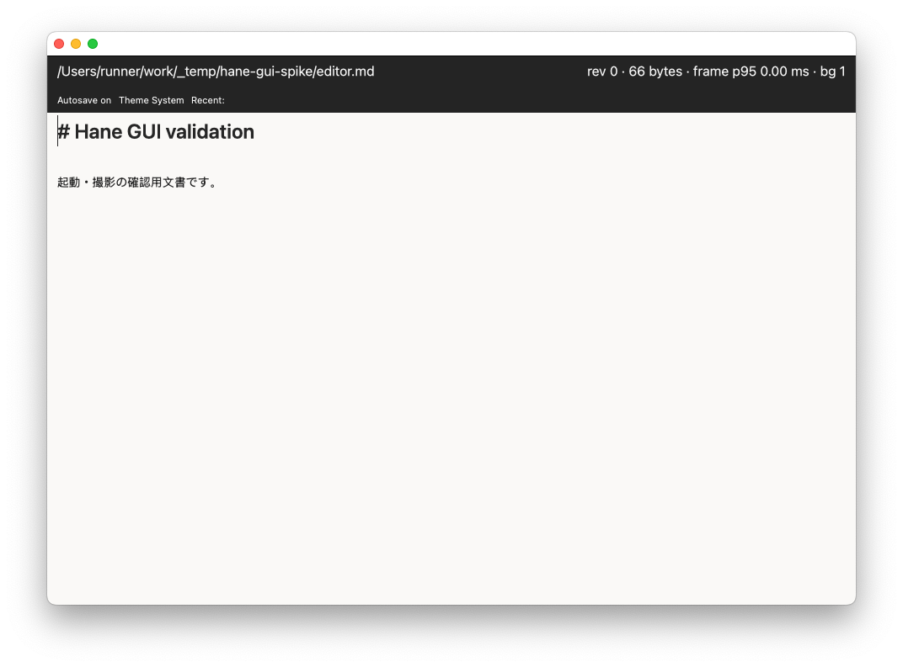

# GitHub-hosted macOS 起動・撮影の実証

2026-09-09 JST。Issue #44 / #55 の GUI 実行経路の調査。

- [GitHub Actions run 34254547035, attempt 1](https://github.com/hide212131/hane/actions/runs/34254547035)
- Hane SHA: `0f5e2b1f0ffb41a248b9a806009de273e8e8d793`
- Workflow SHA: `f7d1c2b8325f9980bb58f2b3f5fed6fa605b95c0`
- Runner: `macos-15`, macOS 15.7.9, ARM64, Apple M1 (Virtual)
- Image: `20260829.0321.1`
- Procedure: `gui-validate/1`, editor scenario, timing-probe build

checkout SHA一致・clean、ビルド、起動、対象PIDのwindow取得、window撮影、対象プロセス終了がすべて成功した。[機械可読な結果](result.json)と[環境記録](environment.txt)を保存する。TCC DBや安全設定は変更していない。

画像をCodexが確認し、Haneの見出しと日本語本文が描画されていることを確認した。初回フォルダ選択ダイアログや空白画面ではない。これは画像の目視確認であり、自動OCRによる判定ではない。画像内のパスは使い捨てhosted runnerのもので、ローカルMacの画像は含めていない。

画像SHA-256: `4cf5d39f32644ca04159a38d8a19b8018fd1029448a6091db43271fa13dee412`

この結果は起動・撮影と当該画面の表示確認である。OS入力、保存、undo/redo、日本語IME変換、ホイール操作、全描画パターン、final judge、merge gateの実証には使わない。`system_profiler`は明示的なMetal情報を返していないため、GPU機能や性能については推測しない。

GitHubの[runner画像設定](https://github.com/actions/runner-images/blob/57fdccbc4a47d85e23cc79eaeb63cb8ae0e997b5/images/macos/scripts/build/configure-tccdb-macos.sh)には画面取得・アクセシビリティ等の設定がある。ただし設定の存在だけでHaneが動作すると判断せず、この実行と画像を根拠にする。

この実証により、専用ローカルrunnerを用意する前にhosted環境で必要な操作シナリオを試すことができる。Issue #44 / #55 の包括的な完了を意味しない。
