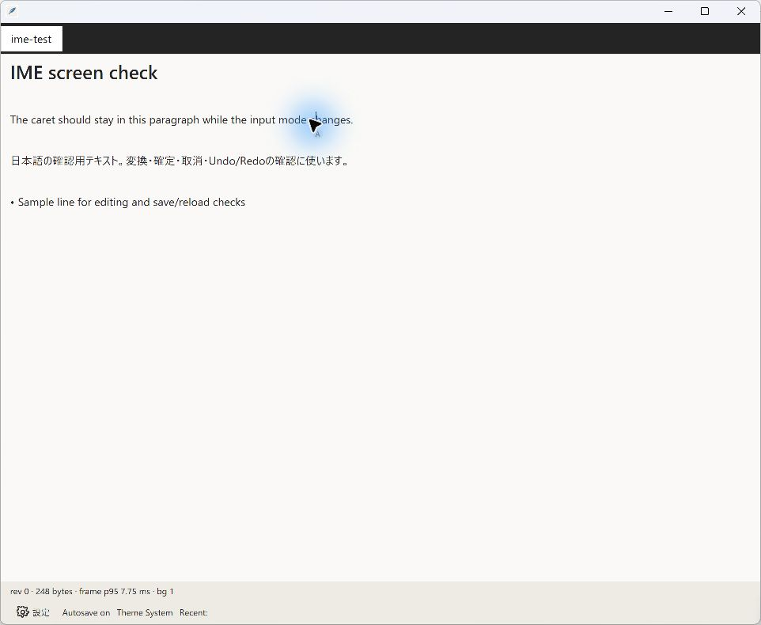
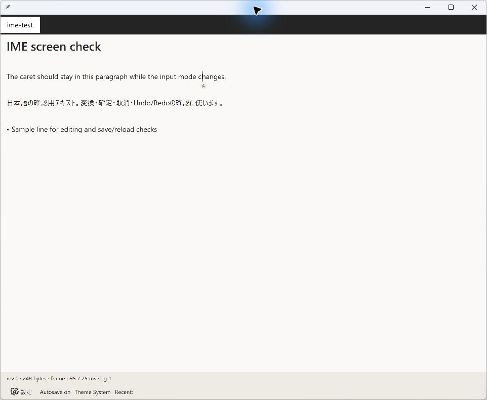
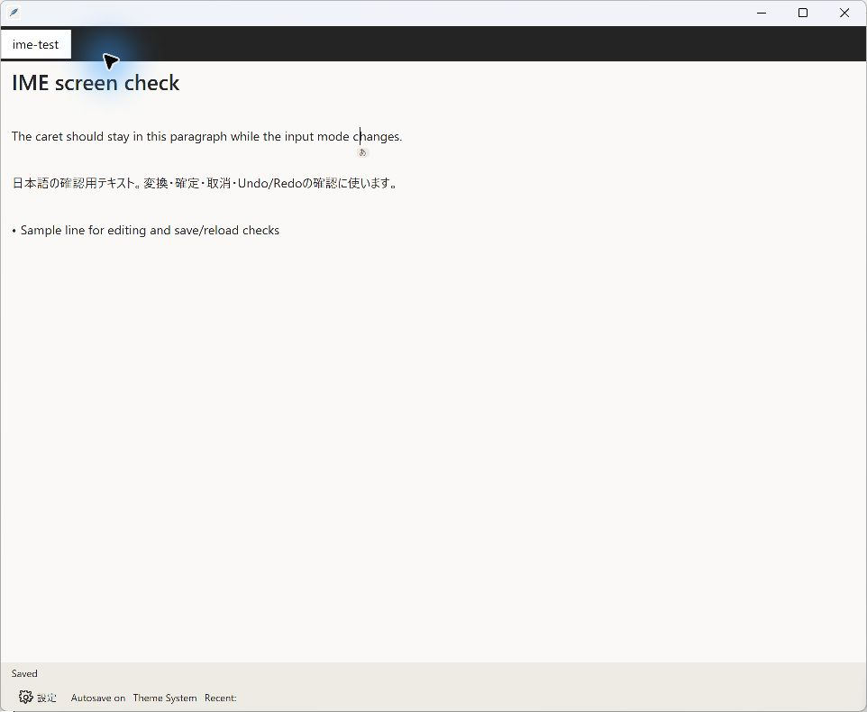
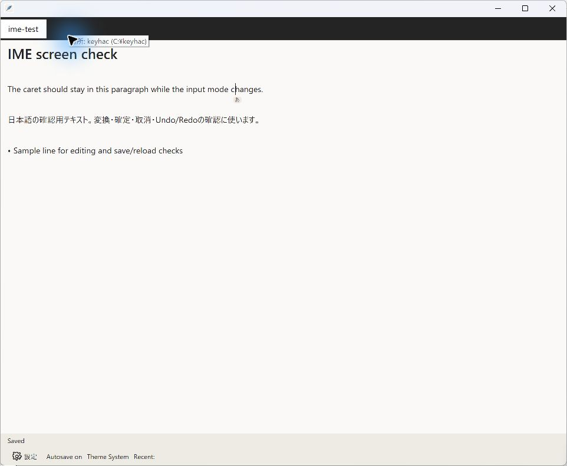

# PR #452 Windows 11 IME実画面検証

- 検証した製品コードのcommit: `1c20a43cac4b99cf455254b2656b4d22c9b00c93`
- 実行ファイルのSHA-256: `4640C2A47C6323079F7116591C789CA63BE729D62530CA6DC890B9DDC25F661E`
- 環境: Windows 11 Home build 26200 / ARM64、日本語 Microsoft IME
- 検証範囲: 同じカーソル位置で `A → あ → A → あ → A`、設定画面からの復帰、別アプリからの復帰

各IME切替キー操作の直後にバッジが変わり、本文への追加入力・クリック・カーソル移動は行っていません。変換・編集確認後、検証用文書を保存・再読込し、元の248 bytesとSHA-256 `E86F929C2E5D22FA042E6A585BDD4228DE5D0CFDDC3E74C20F28B11F846C15C7` に戻ったことを確認しました。

タスクバーのIMEモード操作と `Win+Space` による入力ソース切替は未確認です。この資料は残りの受入確認を代替しません。

## 画面記録

## 画像SHA-256

| ファイル | SHA-256 |
| --- | --- |
| `01-A-before.jpg` | `0793D6A1B5BA021222AD14C22C9B263AA2E27E176B85E10110EAAFD149A6D43C` |
| `02-native-after-shortcut.jpg` | `5CC80076DBD2B0EE8FA47C6B817B942782A45A829E39AFAD7D1C37E2B0A34ED9` |
| `03-A-after-cycle1.jpg` | `E902D0D3BBA42B94F7444D0671CADA9DC89458D3F289D67995FF5C1407E1D359` |
| `04-native-after-cycle2.jpg` | `5CC80076DBD2B0EE8FA47C6B817B942782A45A829E39AFAD7D1C37E2B0A34ED9` |
| `05-A-final-after-cycle2.jpg` | `C67CDBEB6E29B54BD4E89B536E36537B59679A3A42E12FDE98296451E3F75F76` |
| `06-settings-return-native.jpg` | `EAE5EA78642CBDAB8632AE1497E260EA31CB716A4BF5AFF14A22DDD1A67AAAB9` |
| `07-focus-return-native.jpg` | `0A7DB96C8ABA3946CF0E6810E220AF93C2FE2A98D55CCEA4FBB1D26B0DD899B0` |